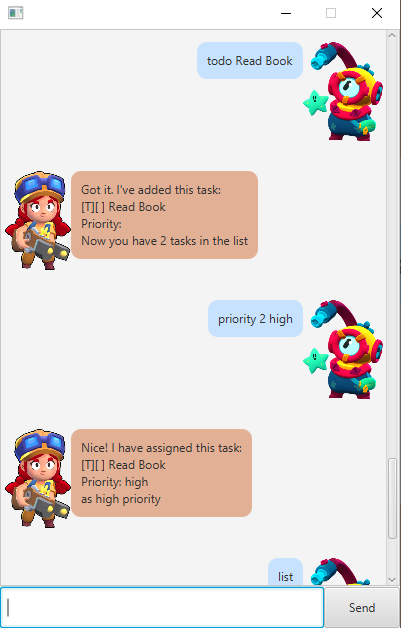

# User Guide for Tick Pro



## Getting Started

1. Have Java 11 installed on your device.
2. Download the latest version of Duke from here.
3. Copy the file to the folder you want to use as the home folder for Duke.
4. Double click the application to run
5. Enter your command in the text box and press enter to execute command. Refer to the features below on the various commands.

## Features

### Feature - Adding Tasks
*Adds a task into the list*

#### Usage - Todo
Command:
```
todo <description>
Eg. todo Read Book
```

Expected output:
```Got it. I've added this task: 
[T][] Read Book
Priority:
Now you have 1 tasks in the list.
```

#### Usage - Deadline
Command:
```
deadline <description> /by <YYYY-MM-DD>
Eg. deadline Finish CS2100 Quiz /by 2021-01-02
```

Expected output:
```Got it. I've added this task: 
[D][] Finish CS2100 Quiz (02/01/2021)
Priority:
Now you have 2 tasks in the list.
```

#### Usage - Event
Command:
```
event <description> /from <start> /to <end>
Eg. event Industry Talk /from 03/06/2021 2pm /to 03/06/2021 4pm
```
Expected output:
```Got it. I've added this task: 
[E][] Industry Talk (from: 03/06/2021 2pm to: 03/06/2021 4pm)
Priority:
Now you have 3 tasks in the list.
```

### Feature - List
*Displays all tasks in your list*
#### Usage
Command: `list`

Expected output:
```Here are the tasks in your list: 
1. [T][] Read Book
Priority:
2. [D][] CS2100 Quiz (02/01/2021)
Priority:
3. [E][] Industry Talk (from: 03/06/2021 2pm to: 03/06/2021 4pm)
```

### Feature - Mark
*Marks a task in your list as completed*
#### Usage
Command:
```
mark <task_number>
Eg. mark 2
```

Expected output:
```
Nice! I've marked this task as done:
[D][X] CS2100 Quiz (02/01/2021)
Priority:
```

### Feature - Unmark
*Marks a task in your list as not completed*
#### Usage
Command:
```
unmark <task_number>
Eg. unmark 2
```

Expected output:
```
Nice! I've marked this task as not done:
[D][ ] CS2100 Quiz (02/01/2021)
Priority:
```

### Feature - Delete
*Deletes a task in your list*
#### Usage
Command:
```
delete <task_number>
Eg. delete 1
```

Expected output:
```
Noted. I've removed this task:
[T][ ] Read Book
Priority:
```

### Feature - Find
*Searches for matching tasks in your list based on a keyword*
#### Usage
Command:
```
find <keyword>
Eg. find talk
```

Expected output:
```
Here are the matching tasks in your list with the keyword "talk":
1. [E][ ] Industry Talk (from: 23/12/2023 10am to: 23/12/2023 12pm)
Priority:
2. [E][ ] Career Talk (from: 02/03/2023 12pm to: 02/03/2023 2pm)
Priority
3. [T][ ] Talk with friends
Priority:
```

### Feature - Priority
*Sets the priority for a task (low / medium / high)*
#### Usage
Command:
```
priority <task_number> <priority_level>
Eg. priority 1 high
```

Expected output:
```
Nice! I've assigned this task:
[D] CS2100 Quiz (02/03/2021)
Priority: high
as high priority
```

### Feature - Bye
*Exits the application*
#### Usage
Command: `bye`

Expected output:
```
Bye! Hope to see you again soon!
```